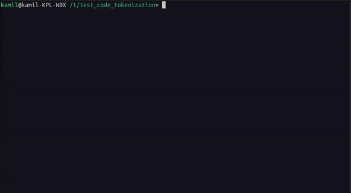

# tokenized-myers-diff

## Semantic code tokenization
Use `--tokenizer semantic-code` option to tokenize code files using [Language Sever](https://microsoft.github.io/language-server-protocol/):

To install all packages for this option, you can run `sudo ./setup.sh` in you terminal
